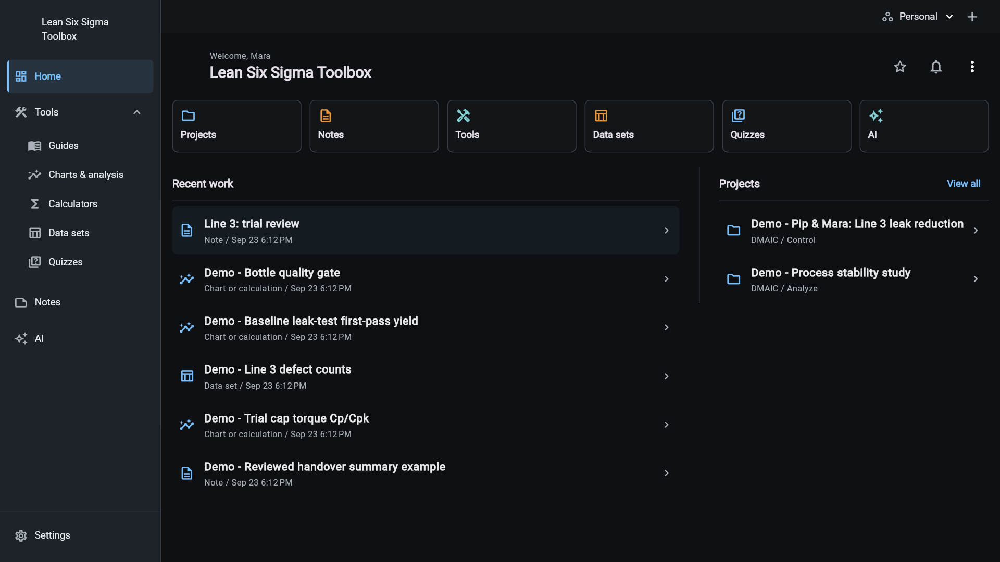
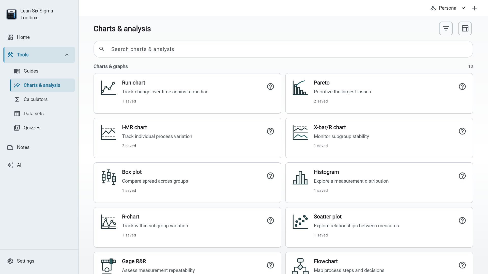
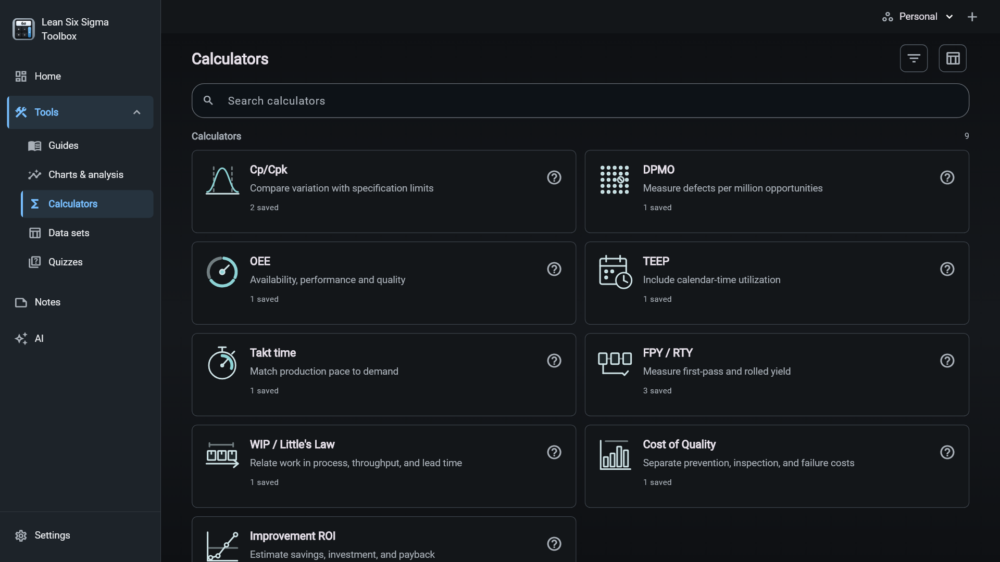
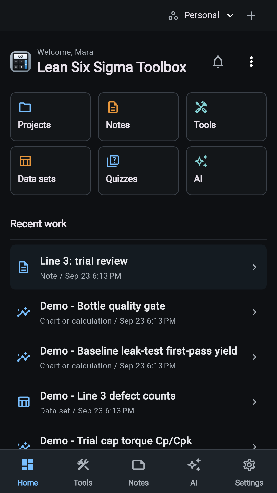
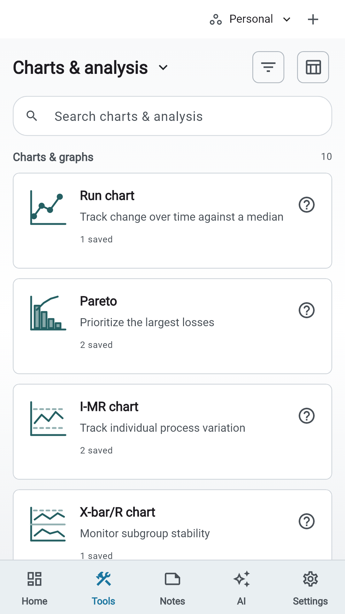
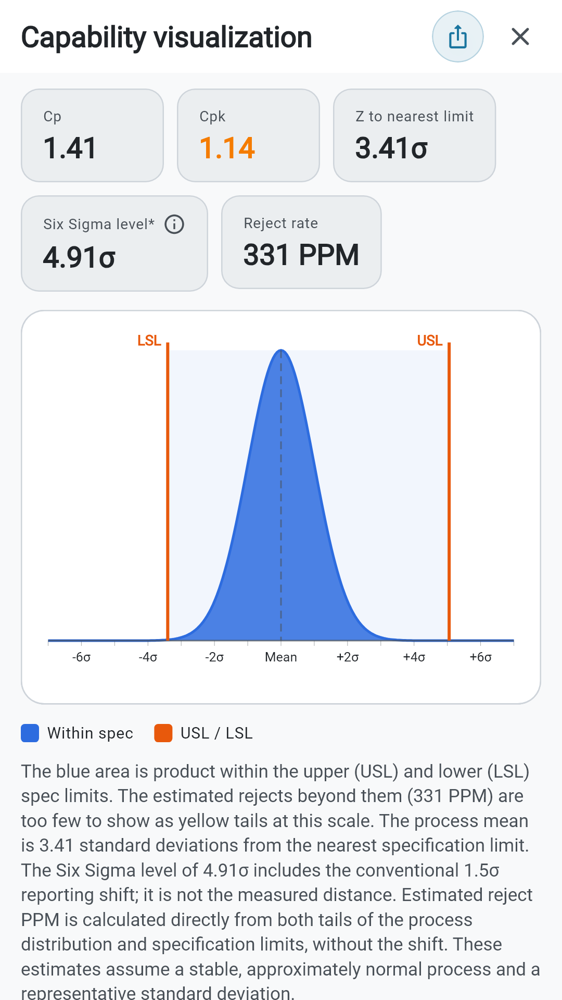
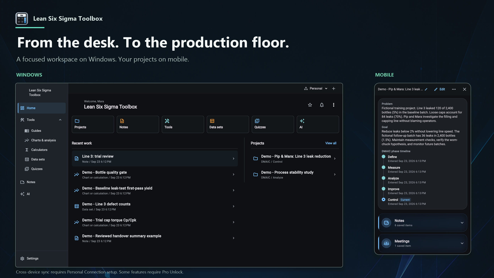
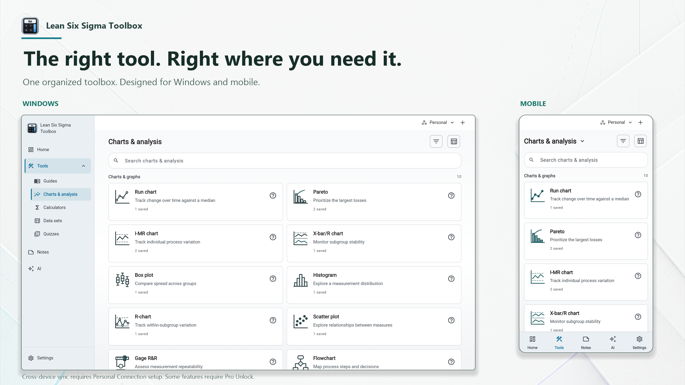

# Current UI preview

September 23, 2026 release candidate. [Release limitations](../../RELEASE_STATUS.md).

These images show real app widgets using fictional demo data in an isolated
Flutter test renderer. They are not native release-binary or physical-device
captures. Marketing compositions retain the screenshot pixels and add captions;
the AI output shown is a seeded example. No customer data or credentials appear.

## Windows

## Mobile

## Promotional compositions

Clean desktop renders are 1920 x 1080; phone renders are 1080 x 1920.
Duo artwork is 2560 x 1440 and is not a phone screenshot-slot image.
Store upload and final signed-build parity review remain separate publisher steps.
